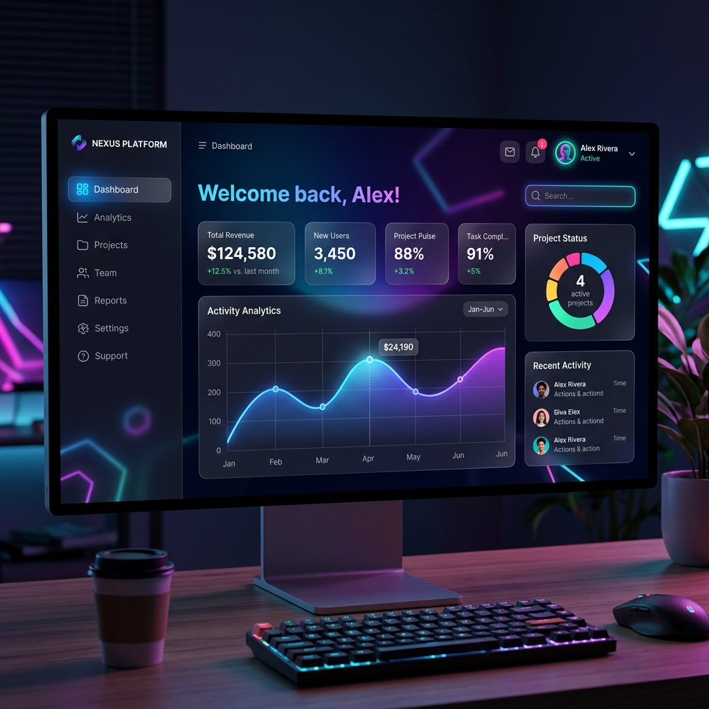
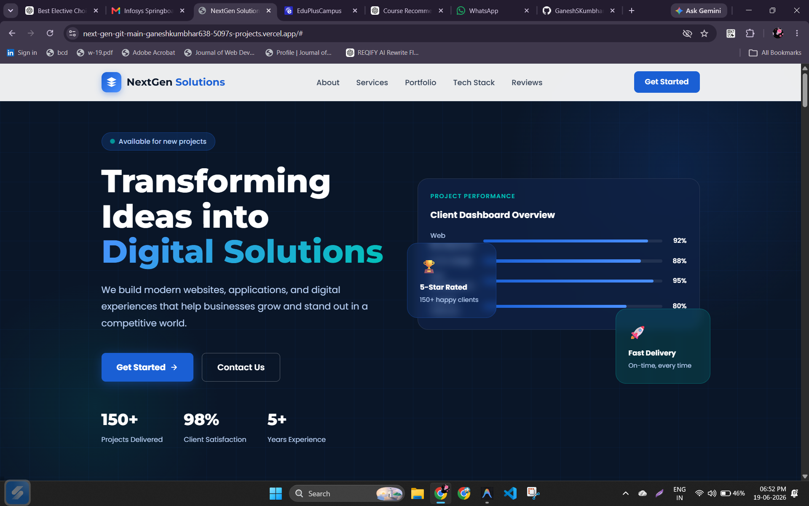
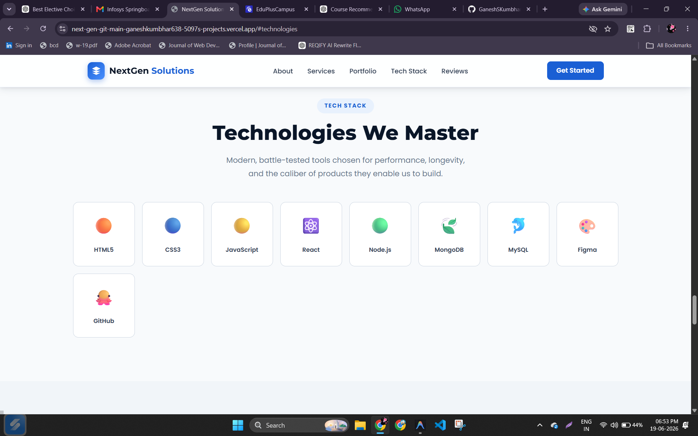
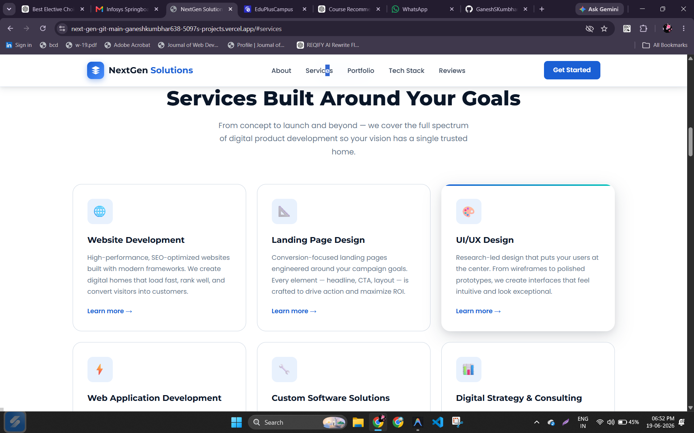
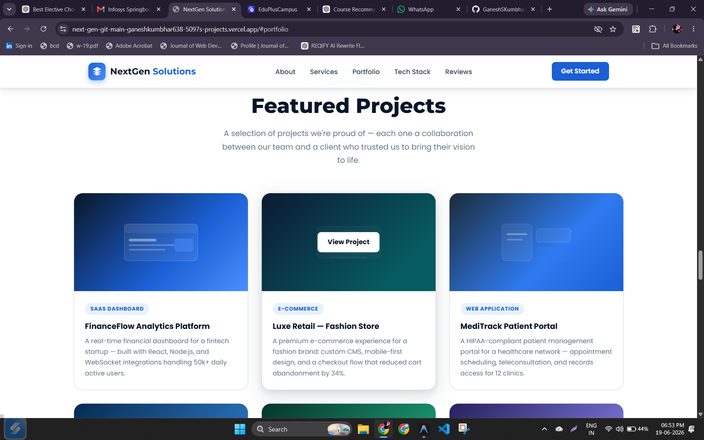
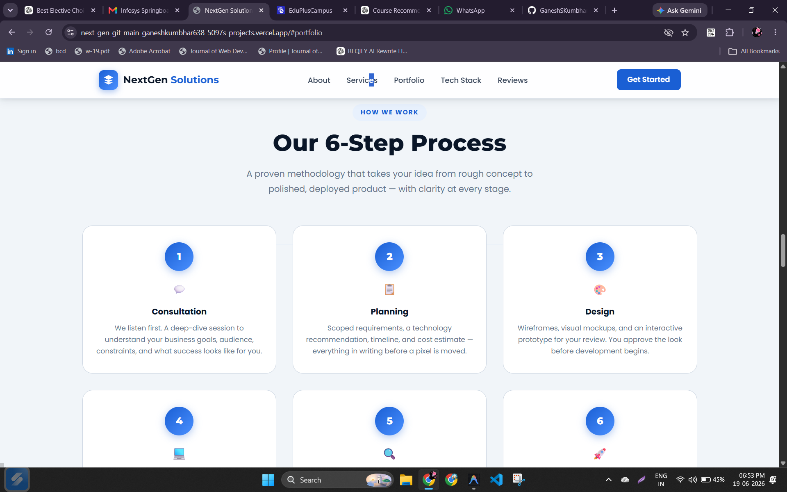
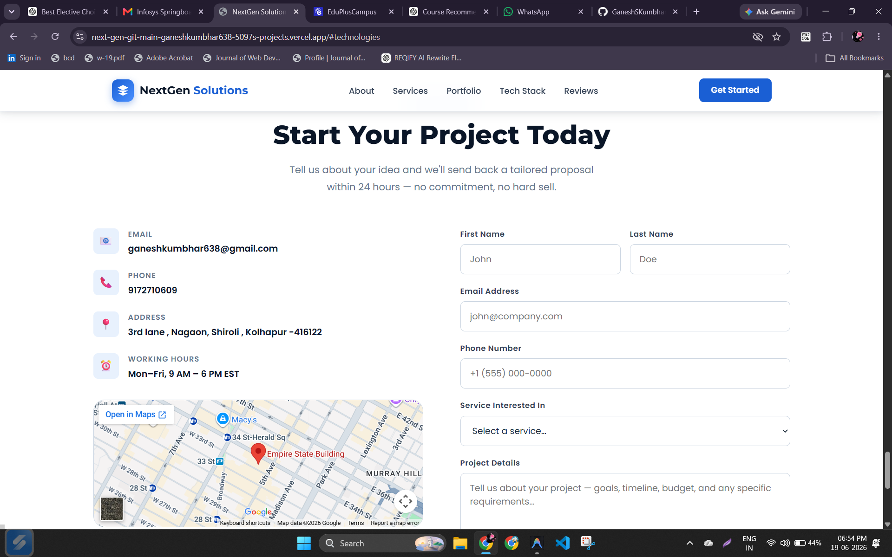

# 🚀 NextGen Web Dashboard



## 📊 Dashboard Preview



*Dashboard view with interactive cards and charts.*

## ✨ Overview
A sleek, modern web application dashboard built with **vanilla HTML, CSS, and JavaScript**. It showcases premium UI techniques like **glassmorphism**, **vibrant gradients**, **dark mode**, and **micro‑animations** to deliver a stunning first impression.

## 🛠️ Tech Stack
- **HTML5** – Semantic structure and accessibility.
- **CSS3** – Custom design system with HSL‑based color palette, glassmorphism, and smooth transitions.
- **JavaScript (ES6+)** – Core interactivity and dynamic content.
- **Google Fonts** – `Inter` for a clean, professional look.

## 📦 Installation
```bash
# Clone the repo (if hosted)
git clone <repo-url>
cd NextGen

# No dependencies – just open the file
start index.html  # Windows
```

## ▶️ Usage
Open `index.html` in any modern browser. The dashboard features:
- **Responsive layout** – adapts to desktop, tablet, and mobile.
- **Interactive cards** – hover effects with subtle scaling and shadows.
- **Live chart placeholders** – ready for integration with Chart.js or similar.

## 🎨 Design Highlights
- **Glassmorphism** – frosted‑glass panels with `backdrop-filter`.
- **Dynamic gradients** – HSL‑derived color scheme for a vibrant yet harmonious look.
- **Micro‑animations** – smooth fades, slides, and hover transitions powered by CSS `transition` and `keyframes`.
- **Dark mode** – automatically respects system theme using `prefers-color-scheme`.
- **Premium typography** – `Inter` font with balanced weight hierarchy.

## 📂 Project Structure
```
NextGen/
├─ index.html        # Main entry point
├─ style.css         # Global styles & design system
├─ script.js         # Core logic & interactions
└─ assets/           # Images, icons, etc.
```

## 🧪 Testing & Development
1. Open `index.html` in a browser.
2. Inspect elements to see the CSS variables and design tokens.
3. Modify `style.css` to experiment with colors, blur radius, or animation timings.

## 🤝 Contributing
Feel free to fork the repo and submit pull requests. Suggested contributions:
- Add new UI components (modals, sidebars).
- Integrate a chart library for live data visualisation.
- Implement theme toggling beyond system preference.

## 📸 Screenshots

Below are key screenshots showcasing the UI and functionality.


*Dashboard view with interactive cards and charts.*



*Overview of technologies used.*



*List of services provided.*



*Project listings.*



*Flow diagram of the application.*



*Contact information layout.*

## 📜 License

This project is open‑source under the MIT License.

---

*Created with ✨ Antigravity – the advanced AI coding assistant*